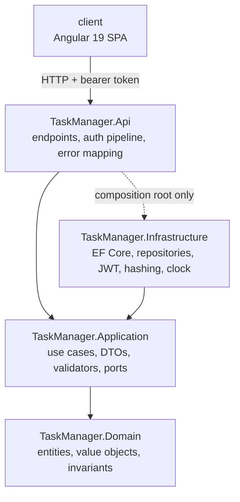
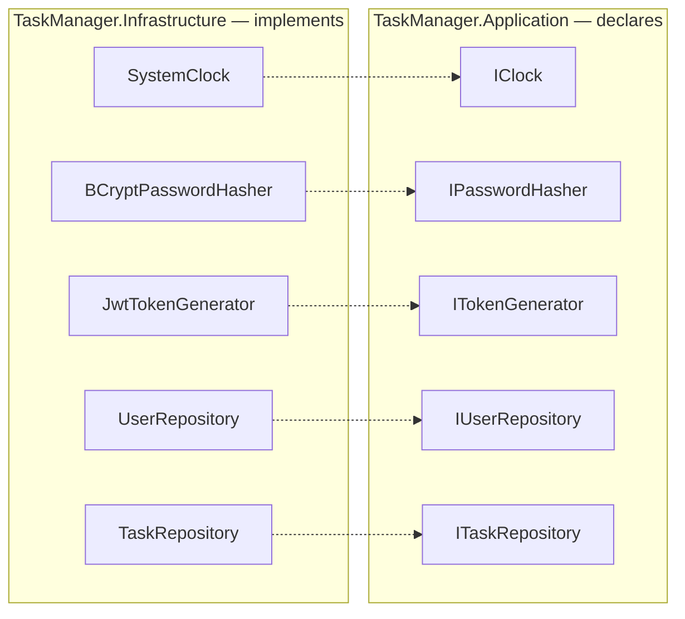
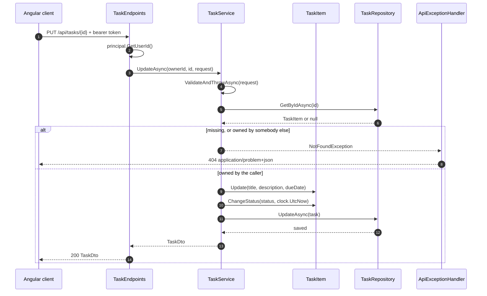
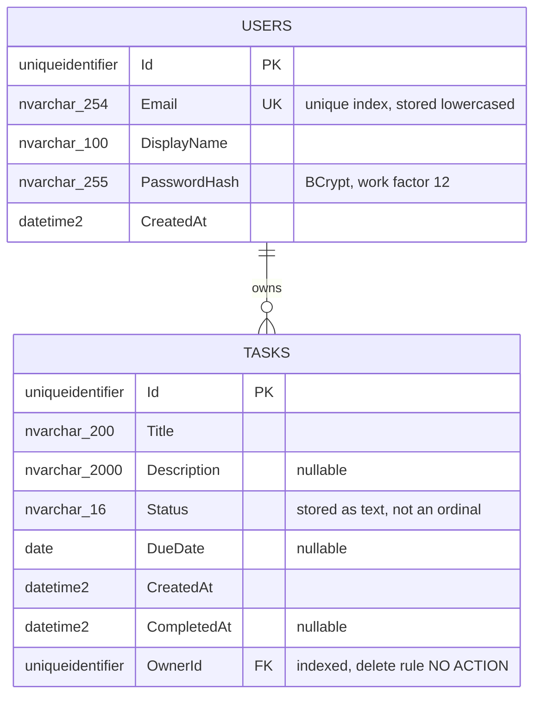
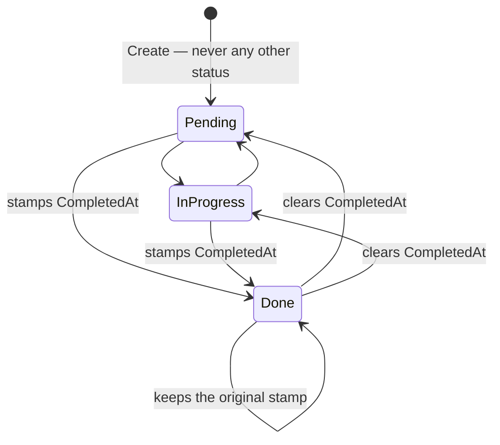

# Architecture

## The dependency rule



Dependencies point inward and nothing points back. `TaskManager.Api` references
`TaskManager.Infrastructure` only to wire dependency injection; endpoints depend on
application-layer abstractions.

Three rules follow from this and are worth stating because they are the ones that get broken:

1. **No business rule lives in an endpoint.** Ownership checks, status transitions and
   validation belong to the application or domain layer, so they hold for any entry point and
   can be tested without HTTP.
2. **No `DateTimeOffset.UtcNow` outside `SystemClock`.** Every rule that depends on time takes
   the clock through `IClock`, which is what lets tests assert exact timestamps.
3. **No `IQueryable` leaves the data layer.** Repositories return entities or scalars.

## Ports

Declared in `src/TaskManager.Application/Abstractions/Ports.cs`, implemented in
`TaskManager.Infrastructure`:

| Port | Adapter |
|------|---------|
| `IClock` | `Time/SystemClock.cs` |
| `IPasswordHasher` | `Security/BCryptPasswordHasher.cs` |
| `ITokenGenerator` | `Security/JwtTokenGenerator.cs` |
| `IUserRepository` | `Persistence/Repositories/UserRepository.cs` |
| `ITaskRepository` | `Persistence/Repositories/TaskRepository.cs` |

The dependency inversion is the whole point: the application layer declares what it needs, and the
outermost ring supplies it.



**Deliberately absent:** `IUnitOfWork` (`DbContext` already is one and nothing here spans two
entities), CQRS, MediatR, a generic `IRepository<T>`, the Specification pattern, AutoMapper and
per-layer DTO duplication. Each abstraction has to justify itself with a test that could not be
written without it.

## Anatomy of a feature

A feature is one vertical slice. `Users` is the reference implementation; every file below has a
counterpart in it.

```
src/TaskManager.Domain/<Feature>/
    <Entity>.cs                     entity: private setters, static factory, invariants
    <ValueObject>.cs                only when a rule needs a type of its own

src/TaskManager.Application/Abstractions/Ports.cs
    I<Entity>Repository             added to the existing file

src/TaskManager.Application/<Feature>/
    Contracts.cs                    request and response records
    <Feature>Service.cs             the use-case interface and its implementation
    <Request>Validator.cs           one FluentValidation validator per request

src/TaskManager.Infrastructure/Persistence/
    Configurations/<Entity>Configuration.cs
    Repositories/<Entity>Repository.cs
    Migrations/                     generated, never hand-edited

src/TaskManager.Api/Endpoints/
    <Feature>Endpoints.cs           one MapGroup, TypedResults, explicit Produces

tests/TaskManager.Domain.Tests/<Feature>/<Entity>Tests.cs
tests/TaskManager.Application.Tests/<Feature>/<Feature>ServiceTests.cs
tests/TaskManager.Application.Tests/<Feature>/<Request>ValidatorTests.cs
tests/TaskManager.Infrastructure.Tests/<Feature>/<Entity>RepositoryTests.cs
tests/TaskManager.Api.Tests/<Feature>/<Feature>EndpointTests.cs

client/src/app/features/<feature>/
    <feature>.models.ts
    <feature>.service.ts            typed HTTP calls
    <feature>.store.ts              one signal-based store per feature
    <feature>-list.component.ts|html
    <feature>-form.component.ts|html
```

## How a request travels

`PUT /api/tasks/{id}` exercises every rule the exercise is graded on: authentication, ownership,
validation, a domain invariant and error mapping. Nothing in the endpoint decides anything.



The repository is asked for the task **by id alone**. Filtering by owner there would give the
authorisation rule a second, silent home; keeping it in the service is what lets it be unit-tested
without HTTP and without a database.

## The data



Instants are stored as UTC `datetime2` throughout, applied by a single convention in
`AppDbContext.ConfigureConventions`. `DueDate` is a calendar date and maps to `DateOnly`, so a due
date never shifts by a day across time zones.

## The one stateful rule

`CompletedAt` is the only field whose value depends on a transition rather than on the request.
BR-206 and BR-211 are easier to see as a machine than as prose.



`ChangeStatus` returns early when the status is unchanged, which is what makes the self-transition
behave: completion time records when the work was finished, not when the record was last edited.

## Conventions

**Entities.** Private setters, a `private` parameterless constructor for EF Core, and a static
factory that enforces the invariants. Timestamps are passed in, never read from the ambient clock:
the domain does not depend on `IClock` either.

**Errors.** The domain throws `DomainException`. The application layer throws `NotFoundException`,
`ConflictException` or `InvalidCredentialsException`; FluentValidation throws its own
`ValidationException`. `Api/Common/ApiExceptionHandler.cs` maps each to an RFC 7807 response —
400, 401, 404, 409 — with validation failures under an `errors` object keyed in camelCase.
Anything unmapped stays a 500, on purpose.

**Ownership.** A record that belongs to another user is reported as **404, never 403**, so the API
does not confirm that an unseen record exists.

**HTTP.** `GET` collection and item, `POST` returning 201 with a `Location` header, `PUT`
returning 200, `DELETE` returning 204. Filters arrive as query-string parameters.

**Persistence.** One `IEntityTypeConfiguration<T>` per entity, explicit table name, explicit
maximum lengths, indexes declared. Value objects are stored through a value converter.

**Tests.** xUnit with Shouldly, and NSubstitute where a port has to be faked. Names read as
`Method_Condition_ExpectedResult`. Infrastructure and API tests run on SQLite in memory so the
suite needs no container. Every scenario in `docs/specs` maps to a test named in that spec's
traceability table.

**Frontend.** Standalone components with `ChangeDetectionStrategy.OnPush`, a signal-based store
per feature, reactive forms mirroring the server rules, and server `ProblemDetails` surfaced
inline when the two disagree.
